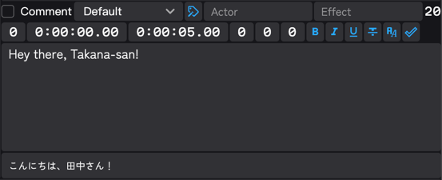
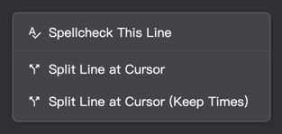
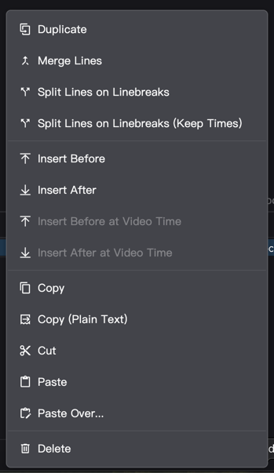
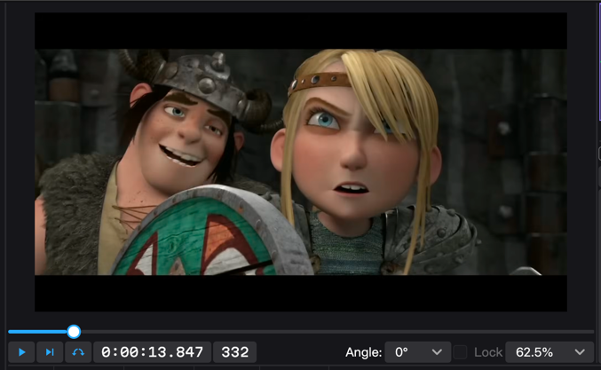
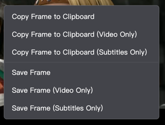
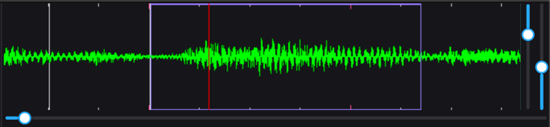
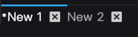

Ameko's user interface draws heavily from Aegisub, and should feel familiar to existing Aegisub users. Here is a general
overview of Ameko's user interface.

## The Editing Area

Most users will probably spend the bulk of their time in the editing area. The editing area is linked to the active
line, and consists of a large textbox for the line's text content, and a host of auxiliary buttons and textboxes for
adjusting the line's metadata and formatting. If a reference file is attached, the corresponding lines from the
reference will be displayed in an additional box below the main textbox.

A brief overview of each item and its function:

- Top row
  - Comment toggle. When checked, the line is a comment, and will not be displayed in the video.
  - Style selector
  - Edit style button
  - Name of the character speaking the line. Not displayed in the video, but can be useful for editing and automation.
  - Effect to use on the line. Generally only used for automation scripts.
  - The number of characters in the longest line of the subtitle.
- Bottom row
  - Layer (Z-index). Lines with a higher layer will be placed on top of lines with a lower layer.
  - Time the line appears on the screen
  - Time the line disappears from the screen
  - Offset from style's left margin. Set to 0 to use the style's margin
  - Offset from style's right margin. Set to 0 to use the style's margin
  - Offset from style's vertical margin. Set to 0 to use the style's margin
  - Inserts a bold `\b1` tag at the cursor position, `\b0` if the text is already bold, or both if text is selected.
  - Inserts an italic `\i1` tag at the cursor position, `\i0` if the text is already italic, or both if text is
    selected.
  - Inserts an underline `\u1` tag at the cursor position, `\u0` if the text is already underlined, or both if text is
    selected.
  - Inserts a strikethrough `\s` tag at the cursor position, `\s0` if the text is already struck through, or both if
    text is selected.
  - Opens a font dialog and inserts the corresponding `\fn` tag at the cursor position.
  - Commit changes to this line and move to the next one, creating one if needed.

### Editing Area Context Menu

Right-click within the textbox to open the context menu.

- Opens the spellchecking dialog to the selected line.
- Split the line into two at the cursor position, with estimated start and end times.
- Split the line into two at the cursor position, both with the same start and end times.

## The Subtitle Grid

The subtitle grid displays all lines in the file and an overview of their metadata (start time, actor, etc.)

### Subtitle Grid Context Menu

Right-click on any line in the subtitle grid to open the context menu.

- Create a duplicate of the selected lines
- Merge two or more lines together
- Split the selected lines on linebreaks `\N`, with estimated start and end times.
- Split the selected lines on linebreaks `\N`, with the same start and end times.
- Insert a new line before the selected line.
- Insert a new line after the selected line.
- Insert a new line before the selected line, starting at the current video time.
- Insert a new line after the selected line, starting at the current video time.
- Copy the selected lines to the clipboard.
- Copy just the text content of the lines to the clipboard.
- Cut the selected lines to the clipboard.
- Paste lines from the clipboard.
- Paste over (replace fields) with lines from the clipboard. A dialog will be displayed to allow you to choose which
  fields to replace.
- Delete the selected lines.

## The Video Area

When you have a video loaded, the video area serves as your preview window and media player. The video (and your
subtitles!) will be displayed here as you edit and play back your work.

Aegisub users will quickly realize that Ameko's zoom feature behaves completely different to how they're used to. Rather
than scale the size of the video area to the video, shrinking the rest of the UI, Ameko scales the video _within_ the
video area, and provides scrollbars to pan the video when it gets too big. Of course, the area is also resizable should
you want more screen real estate dedicated to the video.

With that said, the other inhabitants of the video area are as follows:

- Top row:
  - Seek bar - Scrub through the video
- Bottom row:
  - Play/Pause - Plays to the end of the file, or pauses playback if currently playing.
  - Play Selection - Plays from the earliest start time to the latest end time of the selection.
  - Toggle Auto-Seek - Enable or disable automatic seeking to the start of the selected line. When disabled,
    double-click on a line to seek to its start.
  - Current timestamp (read-only).
  - Current frame (read-only)
  - Display rotation
  - Toggle size lock - Make Ameko's video area behave like Aegisub's (not yet implemented).
  - Display zoom

### Video Area Context Menu

Right-click on the video to open the context menu.

- Copy the current frame, both video and subtitles, to the clipboard.
- Copy the current frame to the clipboard; video only without the subtitles.
- Copy the current frame to the clipboard; subtitles only without the video.
- Save the current frame, both video and subtitles, to disk.
- Save the current frame to disk; video only without the subtitles.
- Save the current frame to disk; subtitles only without the video.

## The Audio Area

The audio area displays an audio visualization. The visualization does not scroll automatically with the video, but it
will move to the start of the selected line if a seek (auto or manual) is performed.

Below the visualization is a seekbar and controls, and to the right are controls for horizontal and vertical scale. The
visualization contains the following information:

- Keyframes, indicated by a gray line.
- Seconds and Quarter-seconds, indicated by short red ticks and shorter gray ticks at the top and bottom.
- Current video frame, indicated by a red line.
- Current audio position, indicated by a blue line (only displayed while audio is playing).
- Subtitle lines, indicated by a purple box starting at the line's start time and ending at the line's end time.

The audio playback controls, in order:

- Play Active Event: Plays from the Start time to the End time. Also doubles as a pause button.
- Play Before: Plays 500ms before the Start time of the active event.
- Play First: Plays the first 500ms of the active event.
- Play Surrounding: Plays the duration of the active event, plus 500ms before the Start time and after the End time.
- Play Last: Plays the last 500ms of the active event.
- Play After: Plays 500ms after the End time of the active event.

## Tabs

Ameko is a tabbed application. You can open multiple subtitle and video files and switch between them at will. Be
mindful that opening multiple video files simultaneously may consume large amounts of RAM and/or lead to unstability.