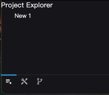
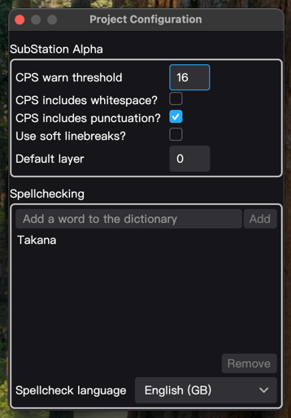
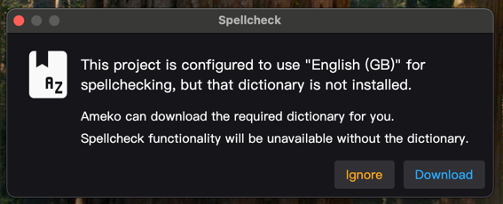
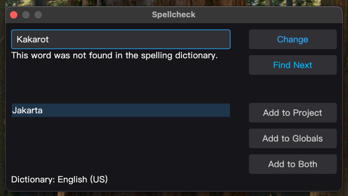
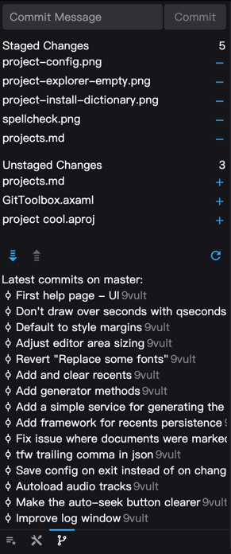

Ameko is designed around Projects. While using Projects isn't required, and you can edit subtitles and otherwise use
Ameko without them, Projects are designed to make working with multiple subtitle files easier, especially when
collaborating with others.

## The Project Explorer



When you first open Ameko, the Project Explorer will be on the left, listing the currently-open documents. When a
project file isn't loaded, the Default Project serves as a dumping ground for the files you open during the session. You
can save the project to a file if you want to leverage the benefits of using a project file.

## Opening a Folder as a Project

If you have an established project directory, you can bring the structure into Ameko by opening the folder as a project.
This will load all applicable sub-folders and subtitle files into the Project Explorer, where you can tailor the
contents and save the resulting project to a file.

## Display Names and You

While Project structures and names _can_ mirror the files on disk, you can rearrange and rename them within the project
as you please without affecting the underlying files. For example, consider the following flat hierarchy, with verbose
file names:

```
Kono Bijutsubu ni wa Mondai ga Aru/
  [AMK] Konobi - 01 - Dialogue.ass
  [AMK] Konobi - 01 - Typesetting1.ass
  [AMK] Konobi - 01 - Typesetting2.ass
  Konobi - 01 - Captions.ja.srt
  [AMK] Konobi - 02 - Dialogue.ass
  [AMK] Konobi - 02 - Typesetting1.ass
  [AMK] Konobi - 02 - Typesetting2.ass
  Konobi - 02 - Captions.ja.srt
```

This can be reorganized and cleaned up within the project using display names and folders without messing with the
existing files:

```
01/
  Dialogue.ass
  TS1.ass
  TS2.ass
  Captions.srt
02/
  Dialogue.ass
  TS1.ass
  TS2.ass
  Captions.srt
```

## Project Configuration



One of the key benefits of using Projects when working in a team is synced configuration. Options set in the Project
Configuration will override user preferences while the project is loaded. This is great for keeping everyone's CPS warn
threshold is the same, and critically, keeping a shared spellcheck dictionary and making sure everyone is using the same
spellcheck language. If the project is set to use English (GB), for example, _everyone_ will be using English (GB), and
that extra u in colour won't be missed.



Users will be prompted to download the appropriate dictionary if they don't already have it.



Words can be added to the project dictionary directly from the spellchecker.

## Git Integration



When saved in the root of a project (next to the `.git` directory), Project files allow for easy access to basic Git
functions, like commiting, pushing, pulling, and viewing a list of recent commits.
